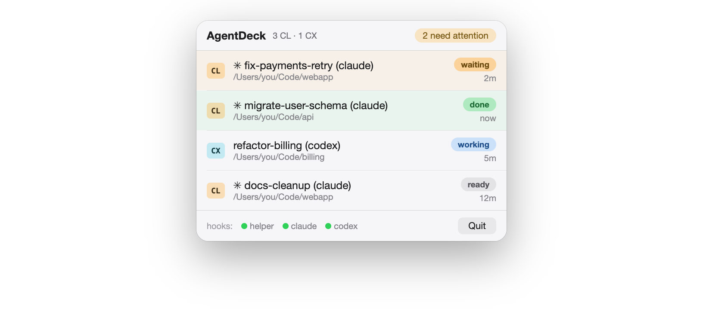

# AgentDeck

macOS menu-bar monitor for every **Claude Code** and **Codex** terminal
session you have running. See at a glance which agents are working, which
finished, and which are **blocked waiting on you** — then click a row to jump
to that exact iTerm2 tab/pane.

- Live states per session: `ready · working · waiting · done · error`
- Attention count in the menu bar; unacknowledged waiting/error/done sort first
- Row titles: Codex session names (`/rename`), Claude's live iTerm tab
  titles, folder name as fallback; click = acknowledge + focus pane
- Event-driven via the CLIs' lifecycle hooks — no polling, no output scraping



**Scope (v1):** macOS 14+, iTerm2, Claude Code + Codex.

## What it writes on your machine (read this first)

AgentDeck's installer edits two files you own:

- `~/.claude/settings.json` — adds hook entries for 7 lifecycle events
- `~/.codex/hooks.json` — adds hook entries for 5 lifecycle events

Every edit preserves your existing settings and hooks, is idempotent, and
creates a timestamped `.bak` backup next to the file (last 5 kept). Known
trade-off: files are rewritten via JSON serialization, which normalizes
formatting/key order and can change float representation (`1.1` →
`1.1000000000000001`); the backups retain your original bytes.

The hooks invoke a small helper binary
(`~/Library/Application Support/AgentDeck/bin/agentdeck-hook`) on session
events. It writes **metadata-only** snapshots — provider, session id, working
directory, state, timestamp, terminal pane id, agent pid — to
`~/Library/Application Support/AgentDeck/sessions/`.

**Privacy:** no prompts, no responses, no transcripts, no credentials are
read or stored, and nothing leaves your machine. There is a test in the suite
asserting prompt text is never persisted.

Uninstall: quit the app, remove the hook entries mentioning `agentdeck-hook`
from the two config files (or restore the newest `.agentdeck-*.bak`), then
delete `~/Library/Application Support/AgentDeck/` and the app.

## Install (Homebrew)

```sh
brew tap AutoXPilot/tap
brew trust AutoXPilot/tap          # newer Homebrew requires trusting third-party taps
brew install --HEAD agentdeck
agentdeck-setup                      # creates ~/Applications/AgentDeck.app
open ~/Applications/AgentDeck.app
```

Then click **Install hooks** in the popover footer, and add the app to
System Settings → General → Login Items.

Or from source:

```sh
git clone https://github.com/AutoXPilot/AgentDeck && cd AgentDeck
./install-app.sh
```

### Permission prompts you'll see (once each)

- **Automation → iTerm2** on your first row click (that's how pane focusing
  works: AppleScript session select; the `iterm2:///reveal` URL scheme is
  only a fallback because it can silently stop working).
- **Codex hook trust** on its next launch after installing hooks.
- Sessions started **before** the hooks were installed won't report until
  restarted (Claude picks up hooks live; Codex needs a restart).

## How it works

```
claude / codex lifecycle hooks
      └─ "…/agentdeck-hook" claude|codex     (JSON on stdin, exit 0 always)
            └─ ~/Library/Application Support/AgentDeck/sessions/<provider>-<id>.json
                  └─ AgentDeck.app: directory watcher + 15s liveness sweep
```

State mapping — Claude: SessionStart→ready, UserPromptSubmit→working,
PermissionRequest/Notification(permission·idle·elicitation_dialog·
agent_needs_input)→waiting, Stop→done, StopFailure→error, SessionEnd→remove.
`agent_completed` is deliberately ignored: a background task finishing must
not flip the main session's state — Stop owns "done".

Codex registers SessionStart/UserPromptSubmit/PermissionRequest/Stop/
SessionEnd (same `hooks.json` schema as Claude's settings). SessionStart,
UserPromptSubmit, Stop, and SessionEnd verified firing live against
codex-cli 0.145.0; PermissionRequest is accepted by the config but has not
been observed firing. No StopFailure → no error state for Codex. A PID
liveness sweep backstops removal for crashes.

Sessions are removed when their agent exits (SessionEnd, or the sweep for
crashed/closed terminals). Row order freezes while the popover is open so
live events don't reshuffle rows under your cursor; each open re-sorts.

Row titles come from the best available source, refreshed on popover open.
Claude Code writes a descriptive terminal title, so its rows use the live
iTerm tab title. Codex only ever sets `<folder> (codex)` as its title, but
records names set via `/rename` in `~/.codex/session_index.jsonl` keyed by
session id — so Codex rows read from that index (read-only) and fall back
to the tab title, then the folder name.

## Hardening notes

- On launch the app compares the bundled helper's SHA-256 against the stable
  copy hooks invoke and atomically updates it on drift — upgrading can never
  leave hooks running an old helper. A stale helper shows as unhealthy in
  the footer (`hooks: ● helper ● claude ● codex` = setup health, not
  session activity).
- Snapshots predating the last boot are dropped (pids are meaningless across
  reboots); a pid owned by another user counts as dead (agents run as you —
  that's a recycled pid); a 24h idle cap backstops same-user pid reuse.
- `session_id` is sanitized before becoming a filename; hook payloads can
  never write outside the sessions directory. Stale temp/corrupt files are
  swept. The sessions-dir watcher re-arms if the directory is recreated.
- The helper never blocks an agent turn: bounded stdin read, 8s watchdog,
  silent exit on any error.

## Development

```sh
swift build && ./test.sh    # 67 tests; works with CLT-only or full Xcode
```

See [CONTRIBUTING.md](CONTRIBUTING.md) for the ground rules (each encodes a
production bug this project already hit — quoting, p_comm, AppleScript
dictionary shadowing, and friends).

## License

MIT — see [LICENSE](LICENSE).
